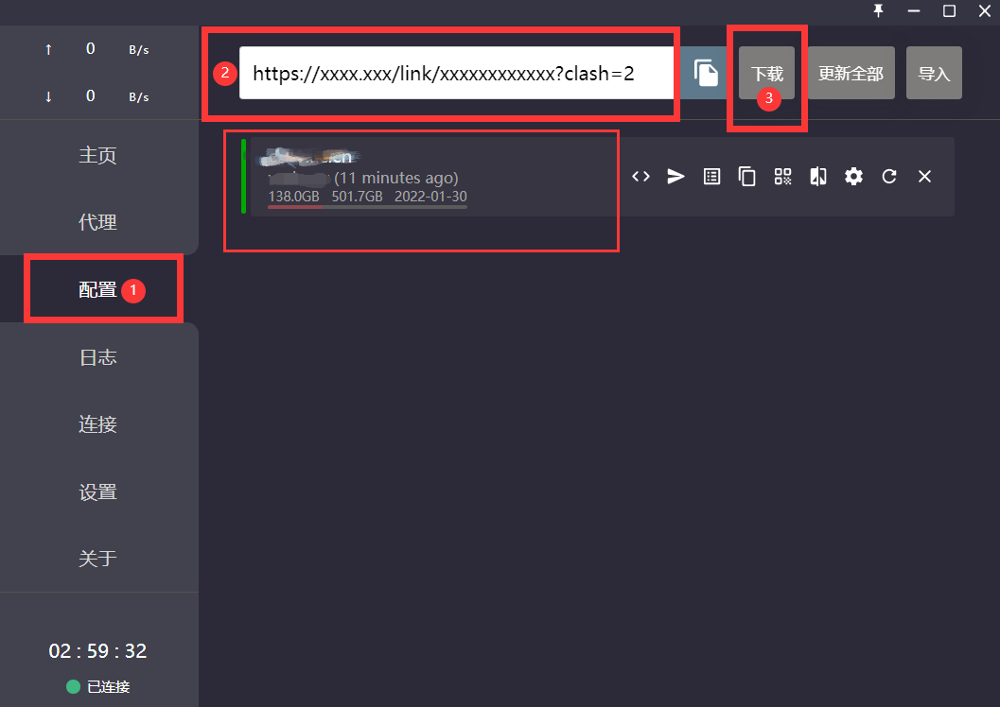
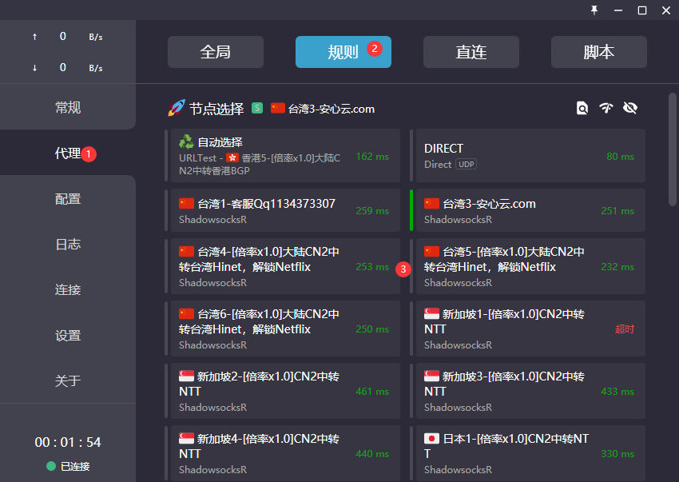
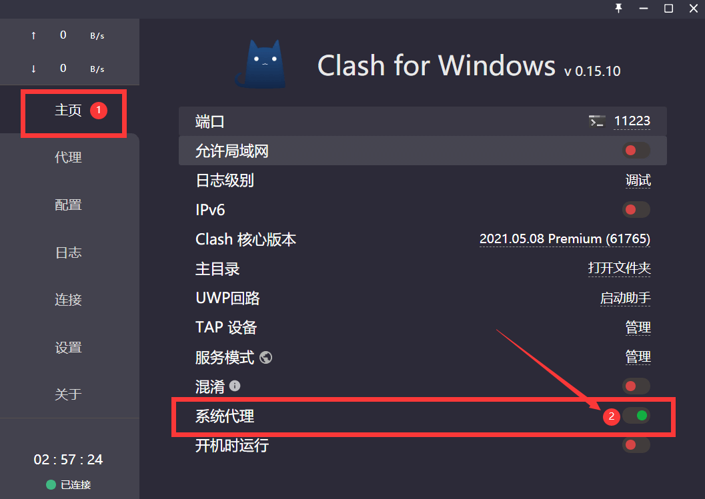
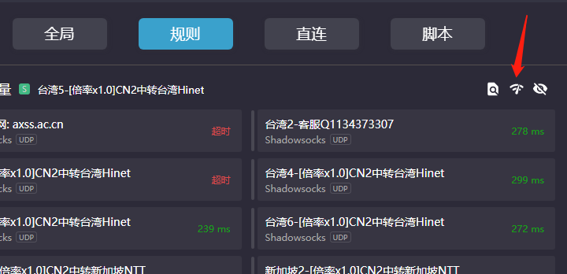
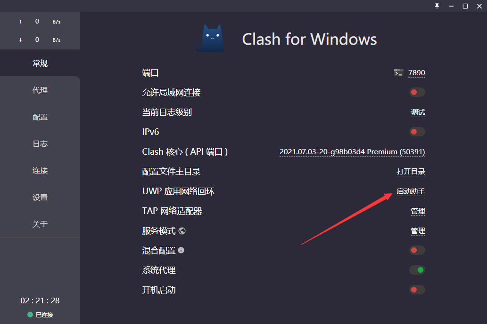
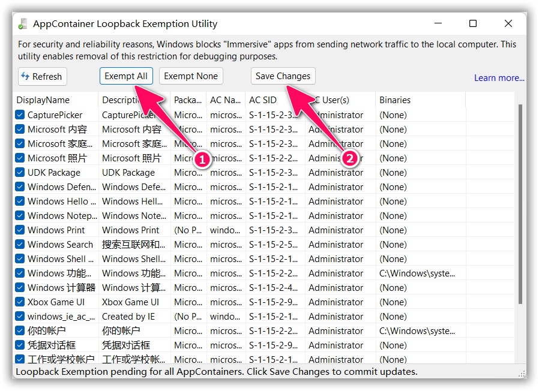
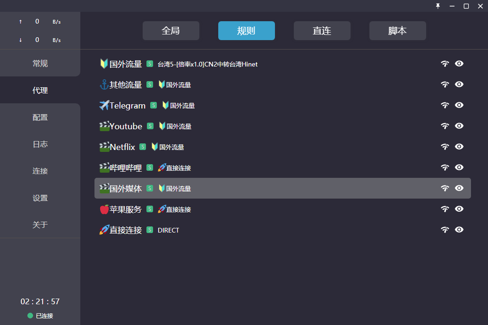

# 使用教程 —— Clash for Windows
- - -

!>系统环境： Windows 10  / Clash for Windows 

**下载和安装 Clash for Windows**

下载地址：
- [Clash for Windows](https://cdn.t9c.co/download/Clash.for.Windows.Setup.0.19.0.exe)

下载并解压Clash（建议解压到Program Files目录下，请不要解压到桌面）， 然后在 Clash for Windows.exe 处点击鼠标右键以“管理员身份运行”，请确保在 UAC 授权中允许。

如果出现Windows安全中心警报，请将【专用网络】和【公用网络】都勾选上，并且点击【允许运行】； 如果杀毒软件提示修改IE代理，请勾选【不再提醒】并选择【允许程序所有操作】，关闭其他代理软件，确保运行正常

**注意事项：**  

!> 安心云加速 将提供关于此应用程序的配置和使用支持服务，然而，由于此应用程序并非 安心云加速 开发，我们的支持人员培训程度也并不相同，我们建议如果用户使用过程中出现应用程序方面的问题，优先考虑询问开发者，或自行使用搜索引擎寻求解决方案。

---

**1. 登录 安心云加速 用户中心**

建议使用 Chrome 浏览器，访问 安心云加速 用户中心，在订阅地址模块可以分别订阅 不同协议的节点，点击复制 Clash 的订阅链接

**2. 导入 安心云加速 接入点信息**

安装并运行 Clash 客户端，点击「Profiles」按钮¹，在输入框内填入复制的订阅链接² ，点击「Download」按钮下载配置文件³

  

在软件内点击 配置在"输入URL下载配置文件"这个输入框中粘贴刚刚复制的订阅地址，点击后面的 下载 按钮

然后选中刚刚下载的配置

点击 代理 选项切换到代理节点界面
点击 【规则】 ，在 🔰国外流量 处选择一个节点

点击 【常规】 选项切换到通用界面
打开 系统代理 开关，其他保持默认即可。
一切准备就绪~~~
***谨记：退出软件或者关机前务必先关闭 系统代理 ***

至此，您即可开启膜法网上之旅。

**Tips**
## 1.延迟测试

**点击代理右侧的测速图标可对该策略组内所有节点进行延迟测试，点击单个节点名称右侧的延迟可对该节点单独测试延迟(检测速度仅作为线路基本检测，与您本地网络有关)**

## 2.UWP 应用使用代理
**在 Windows 10/11 中，微软限制 UWP 应用访问本地回环地址，这导致 UWP 应用无法直接使用代理。Clash for Windows 集成了 EnableLoopback 程序，在 「常规」页面点击「UWP 应用网络回环」启动 EnableLoopback 程序**

**点击 `Exempt All` 勾选所有 UWP 应用¹，然后点击 `Save Changes` 即可²，请注意安装新的 UWP 应用后需要再次手动勾选新添加的应用**

## 3.策略组自动选择节点
**Clash 支持灵活的策略组配置，可以满足多种分流需求，如下图示例所示，实现不同服务使用特定节点而无需频繁手动切换**

## 4.拨号上网连接无法正常使用的解决办法
**如果您的拨号网络名称为中文，则代理功能可能无法正常使用。请您前往 “设置”>“网络和 Internet”>“状态” 位置，点击拨号网络处的 “高级选项”>“编辑” 按钮，将网络名称更改为纯英文。重启电脑后查看效果。

更多功能介绍请查阅 [Clash for Windows 官方文档](https://docs.cfw.lbyczf.com/) 或自行 Google
- - -
注意事项：  
1. 个人专属配置文件是你个人账号密码及节点的总集成，不能泄露给任何人及网络，以防止他人使用及知晓你的密码。    
2. Clash for Windows 如果出现 BUG 请联系软件开发者，安心云加速 无法也没有义务解决客户端层面问题。
