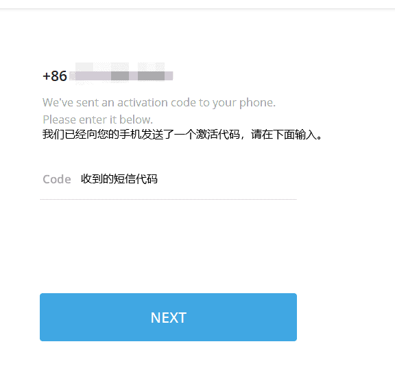
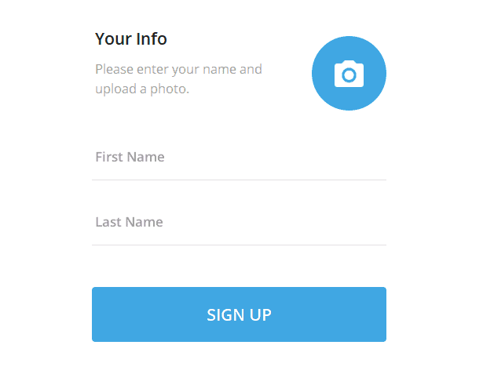
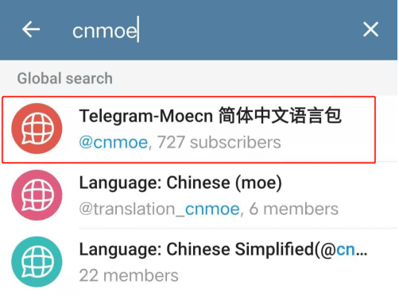
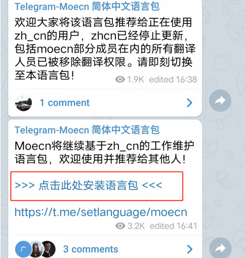
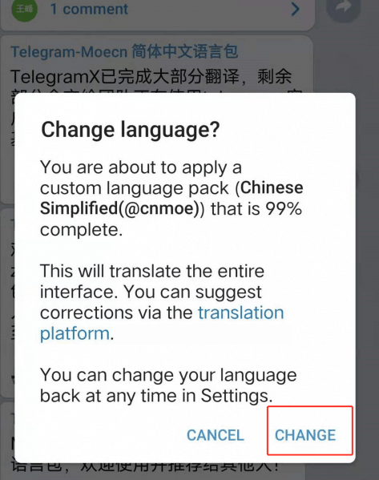

# 使用教程 —— Telegram
- - - - -

Telegram（非正式简称TG）是一款跨平台的即时通信软件。用户可以相互交换加密与自毁消息，发送照片、影片等所有类型文件，主要用户在欧洲和南美洲，
并曾在南美洲五个最大国家和欧洲的四个国家成为排名第一的聊天工具。早在2018年3月份的时候，telegram统计数据月活用户已达2亿。

**注意事项：**  

!>由于此应用程序并非 安心云加速 开发，本教程仅供参考，如果还是不会使用请前往谷歌自行查询使用教程

!> 一切开始前请确保您的代理已经生效，否则请查看本站教程先打开系统代理再进行以下操作
---

**1. 使用浏览器访问 Telegram 官方下载相应程序**

安卓：https://telegram.org/android

*如果是安卓已安装了Google Play的用户，也可以直接在其中搜索Telegram

IOS：https://itunes.apple.com/app/telegram-messenger/id686449807

iPhone及ipad用户在苹果商店可下载

Windows：https://itunes.apple.com/app/telegram-messenger/id686449807

MAC：https://macos.telegram.org

**2. Telegram 怎么注册？**

如果想要使用Telegram，首先务必确保代理工具在正常连接，其次准备一个手机号，注意！！！
大陆用户的手机号可以注册，但存在被封号的风险，请尽量使用国外手机号！！推荐使用GV号，没有GV号的可以去买一个，准备好之后，打开应用就可以开始注册。
!>购买方法请自动谷歌搜索关键词：GV账号购买

购买完毕后，输入你的手机号码后，选择【NEXT】。再次强调！！！中国大陆用户的手机号可以注册，但存在被封号的风险，请尽量使用国外手机号！！！
【推荐使用GV号注册telegram】我这里的教程使用+86中国手机号只是为了给大家作一个演示。

之后你的手机上会收到一条短信验证码，五位数，填入你的验证码，选择【NEXT】。

填入你的个人信息，也就是设置一下头像昵称，完成后点击【SIGN UP】

这样我们就完成了一次账号注册可以开始使用啦。

**3. Telegram怎么设置中文 **

Telegram的系统语言中是没有中文选项的

在搜索框内搜索【cnmoe】，出现的搜索结果第一个，点进去安装

在聊天框内选择【点击此处安装语言包】，在弹出的新对话框内点击【CHANGE】

- - -

**联系我们**

  
  <i class="fa fa-users" aria-hidden="true"></i> Telegram 交流群：[安心云交流群](https://t.me/axsstap)

  <i class="fa fa-users" aria-hidden="true"></i> Telegram 公告群：[安心云公告栏](https://t.me/anxinssr)
